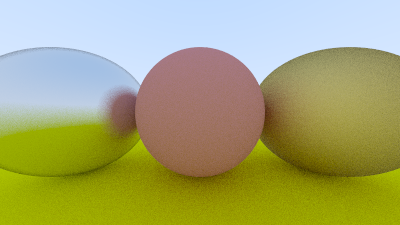
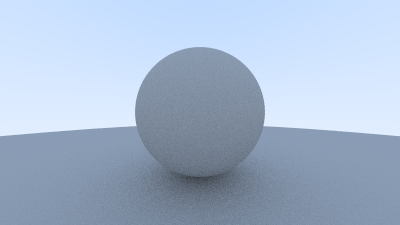
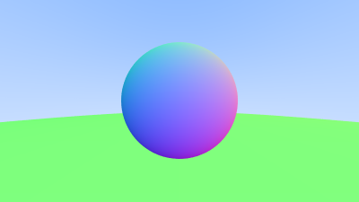

# Ray Tracing

This repository documents my ongoing study of ray tracing principles, drawing knowledge from `raytracing.github.io`. Although the site provides code examples, I've opted to heavily refactor and customize my implementations for learning purposes and to, at times, improve on the code's quality. Notable changes include:

- More consistent organising of code into classes
- Utilising modern C++ (C++14 and up)

**Final Result**


## Stages
(In reverse-chronological order)

### 9. Make Camera Movable


#### Changes

- Add a field of view to camera 
- Enable rotation functionality for camera

### 8. Add Dielectric (ie. clear) Material


#### Changes

- Add dielectric material
- Add reflectance

### 7. Add Materials



#### Changes

- Add abstract class for materials
- Add metal and lambertian materials
- Add fuzz factor for metal reflection rays

### 6. Improve on Diffuse Material



#### Changes

- Remove 'shadow acne'
- Alter to use true Lambertian reflection
- Add gamma correction, giving a more accurate color intensity

### 5. Add A Simple Diffuse Material


#### Changes

- Add `Countdown` to track progress of `render()`
- Implement a simple diffuse material

### 4. Add Antialiasing



#### Changes

- Colour sphere according to its normal vectors
- Create abstract class `HittableEntity` and class `ListOfHittables`
- Add `Interval` class and some misc. utility functions
- Add antialiasing

### 3. Add Sphere to the Scene


#### Changes

- Create Sphere class
- Detect if ray hits sphere. If so, `ray_colour()` returns black

### 2. Flesh out initial Code


#### Changes

- Add a `Camera` and `Viewport` class
- Flesh out rendering logic, rendering an image (see above) based on the y-direction of the rays

### 1. Initial Stage


#### Changes
- Make Python script to view PPM images and integrated it into my C++ code
- Start creating some of the core classes and functions: Vec3, Ray, `render()`, etc.
- Render first image (with some temporary function bodies) to test that the whole process from file creation, writing to the file, to loading/viewing it with the Python script ran correctly

## Dependencies 

This project uses `fmt` and Microsoft's `gsl` libraries. You can download them with:
```
brew install fmt
brew install cpp-gsl
```

## Building and Running

To build and run, follow these steps:

1. Clone or download this repository to your local machine.
2. Make sure you have the required dependencies installed: `fmt` and Microsoft's `gsl` libraries.
3. Open your terminal and navigate to the project directory.
4. Compile the source code using your preferred C++20 compiler, ensuring that the required dependencies are linked
5. Run the program.
